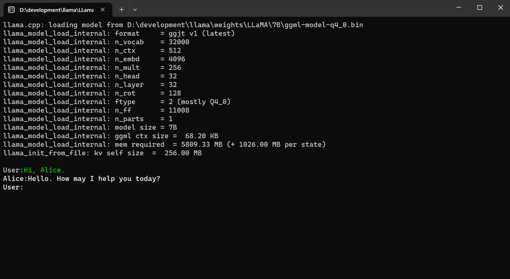

# LLamaSharp - .NET Binding for llama.cpp


The C#/.NET binding of [llama.cpp](https://github.com/ggerganov/llama.cpp). It provides APIs to inference the LLaMa Models and deploy it on native environment or Web. It works on 
both Windows and Linux and does NOT require compiling llama.cpp yourself.

- Load and inference LLaMa models
- Simple APIs for chat session
- Quantize the model in C#/.NET
- ASP.NET core integration
- Native UI integration

## Installation

Just search `LLamaSharp` in nuget package manager and install it!

```
PM> Install-Package LLamaSharp
```

If you want to run it only on CPUs, please install `LLamaSharp.Cpu`. The only difference between them is native library.

If you have GPU on windows but fail to run with the error `failed to load libllama.dll or one of its dependencies`, please try downloading the cublas support dlls [here](https://github.com/ggerganov/llama.cpp/releases). For example, [cudart-llama-bin-win-cu11.7.1-x64.zip
](https://github.com/ggerganov/llama.cpp/releases/download/master-773ee24/cudart-llama-bin-win-cu11.7.1-x64.zip) is the one for CUDA 11.7.

## Simple Benchmark

Currently it's only a simple benchmark to indicate that the performance of `LLamaSharp` is close to `llama.cpp`. Experiments run on a computer 
with Intel i7-12700, 3060Ti with 7B model. Note that the benchmark uses `LLamaModel` instead of `LLamaModelV1`.

#### Windows

- llama.cpp: 2.98 words / second

- LLamaSharp: 2.94 words / second

## Usages

#### Model Inference and Chat Session

Currently, `LLamaSharp` provides two kinds of model, `LLamaModelV1` and `LLamaModel`. Both of them works but `LLamaModel` is more recommended 
because it provides better alignment with the master branch of [llama.cpp](https://github.com/ggerganov/llama.cpp).

Besides, `ChatSession` makes it easier to wrap your own chat bot. The code below is a simple example. For all examples, please refer to 
[Examples](./LLama.Examples).

```cs

var model = new LLamaModel(new LLamaParams(model: "<Your path>", n_ctx: 512, repeat_penalty: 1.0f));
var session = new ChatSession<LLamaModel>(model).WithPromptFile("<Your prompt file path>")
                .WithAntiprompt(new string[] { "User:" );
Console.Write("\nUser:");
while (true)
{
    Console.ForegroundColor = ConsoleColor.Green;
    var question = Console.ReadLine();
    Console.ForegroundColor = ConsoleColor.White;
    var outputs = session.Chat(question); // It's simple to use the chat API.
    foreach (var output in outputs)
    {
        Console.Write(output);
    }
}
```

#### Quantization

The following example shows how to quantize the model. With LLamaSharp you needn't to compile c++ project and run scripts to quantize the model, instead, just run it in C#.

```cs
string srcFilename = "<Your source path>";
string dstFilename = "<Your destination path>";
string ftype = "q4_0";
if(Quantizer.Quantize(srcFileName, dstFilename, ftype))
{
    Console.WriteLine("Quantization succeed!");
}
else
{
    Console.WriteLine("Quantization failed!");
}
```

#### Web API

We provide the integration of ASP.NET core [here](./LLama.WebAPI). Since currently the API is not stable, please clone the repo and use it. In the future we'll publish it on NuGet.

## Demo



## Roadmap

✅ LLaMa model inference.

✅ Embeddings generation.

✅ Chat session.

✅ Quantization

✅ ASP.NET core Integration

🔳 WPF UI Integration

🔳 Follow up llama.cpp and improve performance

## Assets

The model weights is too large to include in the project. However some resources could be found below:

- [eachadea/ggml-vicuna-13b-1.1](https://huggingface.co/eachadea/ggml-vicuna-13b-1.1/tree/main)
- [TheBloke/wizardLM-7B-GGML](https://huggingface.co/TheBloke/wizardLM-7B-GGML)
- Magnet: [magnet:?xt=urn:btih:b8287ebfa04f879b048d4d4404108cf3e8014352&dn=LLaMA](magnet:?xt=urn:btih:b8287ebfa04f879b048d4d4404108cf3e8014352&dn=LLaMA)

The weights included in the magnet is exactly the weights from [Facebook LLaMa](https://github.com/facebookresearch/llama).

The prompts could be found below:
- [llama.cpp prompts](https://github.com/ggerganov/llama.cpp/tree/master/prompts) 
- [ChatGPT_DAN](https://github.com/0xk1h0/ChatGPT_DAN)
- [awesome-chatgpt-prompts-zh](https://github.com/PlexPt/awesome-chatgpt-prompts-zh)

## License

This project is licensed under the terms of the MIT license.